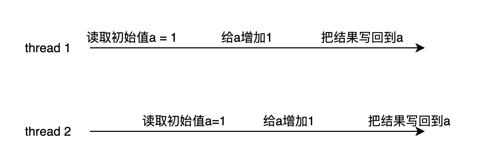

### Process

### Thread

### Interprocess communication
1. 竞争
当多个线程同时访问某个共享的区域时，两者可能在访问相同区域时，同时选择更改数据，导致某个线程的数据更新被丢失了，如两个线程同时更新一个int variable，都是给这个variable +1， 比较巧的执行顺序如图所示:

可以看到这里两个thread都想在初始值为1的variable上+1，本来正确结果应该是两个thread各加一得到3，而出现竞争就会变成2
2. 关键区域
关键区域就是竞争时候不应该同时被访问的地方，举个生活中的例子，一个厕所的坑，同时只应该由一个人来进入，后来的要先检查是否已经有人进入，如果被占用，就等待有空后进入
3. 自旋锁
自旋锁就是这样的一个例子，如果关键区域已经被访问（即被锁），就继续查询，直到锁被释放后进入关键区域，进行操作。
4. sleep awake
5. semaphore
6. mutex
7. monitor
8. 消息传递
9. barrier
10. read-copy update